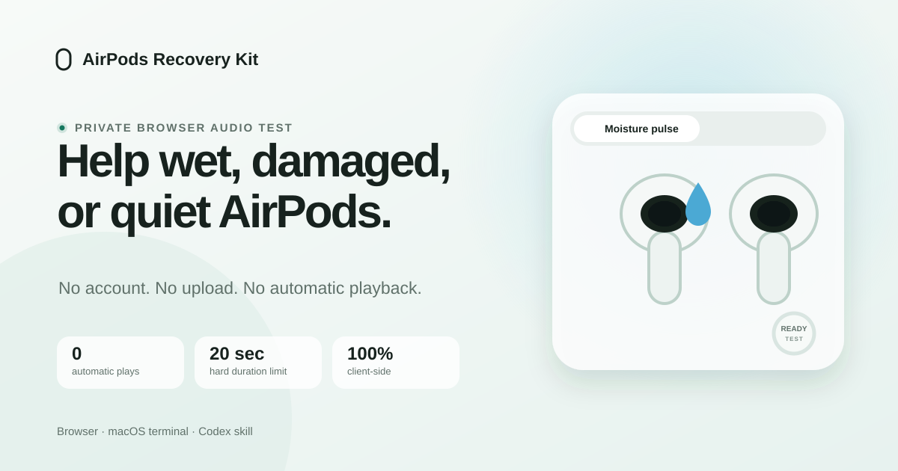

# AirPods Recovery Kit

> Free, private recovery tests for wet AirPods.

[](https://github.com/aryanputta/airpods-recovery-kit/stargazers)
[](https://aryanputta.github.io/airpods-recovery-kit/)
[](https://github.com/aryanputta/airpods-recovery-kit/actions/workflows/pages.yml)
[](LICENSE)

<p align="center">
  <a href="https://aryanputta.github.io/airpods-recovery-kit/">
    
  </a>
</p>

<p align="center">
  <strong><a href="https://aryanputta.github.io/airpods-recovery-kit/">Open the browser tool</a></strong>
  ·
  <a href="#macos-terminal">Use the macOS terminal</a>
  ·
  <a href="#codex-skill">Install the Codex skill</a>
</p>

A free, no-cost one-page tool for wet or water-damaged AirPods, one AirPod not
working, uneven left/right volume, muffled sound, crackling, or distortion.
Sound never autoplays and no device data leaves the browser.

> [!IMPORTANT]
> Dry first, test second. [Apple says](https://support.apple.com/105046) to
> wipe exposed AirPods with a soft, dry, lint-free cloth and let them dry
> completely for at least two hours before use or returning them to the case.
> This project cannot guarantee liquid removal or repair damaged hardware.

## Quickstart

### Browser

[Open the recovery page](https://aryanputta.github.io/airpods-recovery-kit/),
choose a moisture pulse or left/right test, complete both safety checks, and
press Start.

### macOS terminal

```bash
git clone https://github.com/aryanputta/airpods-recovery-kit
cd airpods-recovery-kit

./skills/recover-airpods-audio/scripts/airpods-recovery.sh diagnose
./skills/recover-airpods-audio/scripts/airpods-recovery.sh battery

# Only after 2+ hours of drying, with both AirPods out of your ears.
./skills/recover-airpods-audio/scripts/airpods-recovery.sh \
  pulse --confirm-out-of-ears

# Only after setting system volume below 20 percent.
./skills/recover-airpods-audio/scripts/airpods-recovery.sh \
  channels --confirm-low-volume
```

The route check reports only `AirPods` or `not AirPods`. The battery command
prints only the left, right, case, or overall percentages macOS exposes. It
never prints a personal device name or Bluetooth address.

### Codex skill

```bash
mkdir -p "${CODEX_HOME:-$HOME/.codex}/skills"
cp -R skills/recover-airpods-audio \
  "${CODEX_HOME:-$HOME/.codex}/skills/"
```

Then ask:

```text
Use $recover-airpods-audio to diagnose my quiet left AirPod.
```

## Why

- **User initiated:** sound never autoplays.
- **Bounded:** duration and gain limits live in code and tests.
- **Private:** no account, analytics, cookies, upload, or device identity.

## Safety proof

| Guard | Bound | Verification |
|---|---:|---|
| Automatic playback | `0` | Start stays disabled until both confirmations pass |
| Moisture-pulse duration | `≤ 20 seconds` | JavaScript and WAV tests |
| Web Audio gain | `≤ 0.03` | Constant-bound unit test |
| Terminal volume | Never raised; capped at `12%` only when higher, then restored | Shell contract test |
| Personal device files | `0` | Working-tree and Git-history privacy audit |
| Browser data upload | `0` | Fully static GitHub Pages site |

These are measured safety contracts, not repair-success claims.

## How it works

```text
wet, quiet, or distorted
          │
          ├── strange only with Noise Control → microphone or vent path
          ├── quiet in every mode           → mesh, charge, balance, or driver
          └── moisture suspected            → dry for 2+ hours first
                                                    │
                                      confirm output and position
                                                    │
                                         bounded 165 Hz pulse
                                                    │
                                          left / right comparison
```

The browser audio tests work with any AirPods generation selected as the
output. The optional battery snapshot is best-effort because macOS does not
expose every percentage on every hardware and system combination.

## Validate

```bash
npm test
python3 -m unittest discover -s tests -p 'test_*.py'
./scripts/audit-public.sh
```

Focused fixes are welcome. Read [CONTRIBUTING.md](CONTRIBUTING.md) before
opening an issue or pull request.

## Updates

- **2026-07-25:** Shorter demo-first README, live star count, Google-focused
  metadata, current Apple drying guidance, and crawler validation.
- **v0.1.1, 2026-07-25:** Restoring volume cap, exact battery allowlist,
  browser re-entry guard, and Git-history privacy scan.

## License

[MIT](LICENSE). AirPods is a trademark of Apple Inc. This independent project
is not affiliated with or endorsed by Apple.

## Star history

<p align="center">
  <a href="https://www.star-history.com/#aryanputta/airpods-recovery-kit&Date">
    
  </a>
</p>
